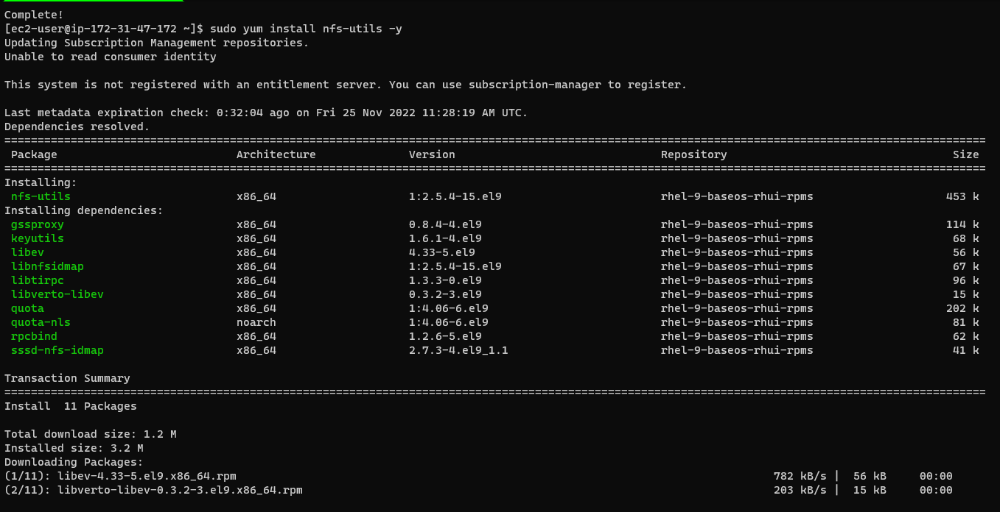
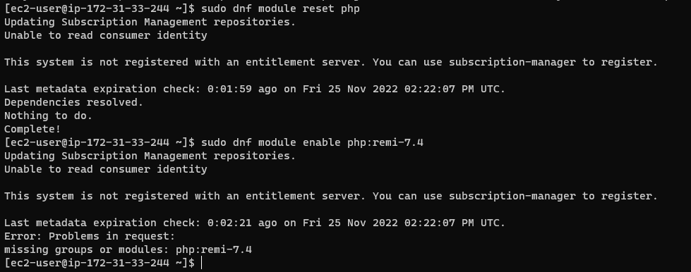
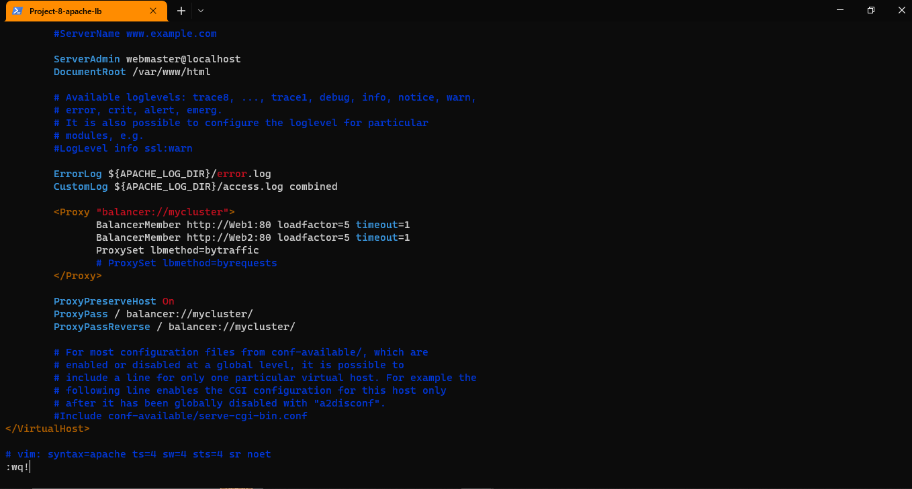

# Project 8: LOAD BALANCER SOLUTION WITH APACHE

In this project one will implement a solution that consists of following components:

Infrastructure: AWS
Webservers Linux: Red Hat Enterprise Linux 8
Database Server: Ubuntu 20.04 + MySQL
Storage Server: Red Hat Enterprise Linux 8 + NFS Server
Load Balancer: Ubuntu Server 20.04
Programming Language: PHP
Code Repository: GitHub

Step 0:  Preparing prerequisites

- Sign in to AWS free tier account and create four new EC2 Instances of t2.nano family with RedHat OS, and one new EC2 Instance of Ubuntu 20.04
- Name the new instances thus;
- Server A name - "NFS server" (Red Hat Enterprise Linux 8 + NFS Server)
- Server B name - "webserver 1" (Red Hat Enterprise Linux 8)
- Server C name - "webserver 2" (Red Hat Enterprise Linux 8)
- Server D name - "Apache Load Balancer" (Ubuntu Server 20.04)
- Server C name - "database server" (Ubuntu 20.04 + MySQL)

Prepare NFS Server:

Spin up a new EC2 instance with RHEL Linux 8 Operating System and Configure LVM on the Server.

`lsblk`

Use gdisk utility to create a single partition on each of the 3 disks

`sudo gdisk /dev/xvdf`

`sudo gdisk /dev/xvdg`

`sudo gdisk /dev/xvdh`

Use `lsblk` utility to view the newly configured partition on each of the 3 disks.

Use pvcreate utility to mark each of 3 disks as physical volumes (PVs) to be used by LVM

`sudo pvcreate /dev/xvdf1`

`sudo pvcreate /dev/xvdg1`

`sudo pvcreate /dev/xvdh1`

Verify that your Physical volume has been created successfully by running

`sudo pvs`

Use vgcreate utility to add all 3 PVs to a volume group (VG). Name the VG webdata-vg
Verify that your VG has been created successfully by running

`sudo vgcreate webdata-vg /dev/xvdh1 /dev/xvdg1 /dev/xvdf1`

`sudo vgs`

Use lvcreate utility to create 3 logical volumes; lv-opt lv-apps, and lv-logs

`sudo lvcreate -n apps-lv -L 14G webdata-vg`

`sudo lvcreate -n logs-lv -L 14G webdata-vg`

`sudo lvcreate -n opt-lv -L 14G webdata-vg`

`sudo lvs`

`lsblk`

format the disks as "xfs"

`sudo mkfs -t xfs /dev/webdata-vg/apps-lv`

`sudo mkfs -t xfs /dev/webdata-vg/logs-lv`

`sudo mkfs -t xfs /dev/webdata-vg/opt-lv`

Create "/var/www/html" directory to store website files

`sudo mkdir /mnt/apps`

`sudo mkdir /mnt/logs`

`sudo mkdir /mnt/opt`

`sudo mount /dev/webdata-vg/apps-lv /mnt/apps`

`sudo mount /dev/webdata-vg/logs-lv /mnt/logs`

`sudo mount /dev/webdata-vg/opt-lv /mnt/opt`

Install NFS server, configure it to start on reboot and make sure it is up and running

`sudo yum -y update`

`sudo yum install nfs-utils -y`

`sudo systemctl start nfs-server.service`

`sudo systemctl enable nfs-server.service`

`sudo systemctl status nfs-server.service`

`sudo vi /etc/exports`

`sudo exportfs -arv`

Edit inbound rules for NFS server

CONFIGURE THE DATABASE SERVER:

Install MySQL server

`sudo apt update`

`sudo apt install mysql-server -y`

Create a database and name it tooling

mysql> `create database tooling;`

mysql> `create user 'webaccess'@'172.31.16.0/20' identified by 'password';`

mysql> `grant all privileges on tooling.* to 'webaccess'@'172.31.16.0/20';`

mysql> `flush privileges;`

mysql> `show databases;`

Prepare the Web Servers:

Install NFS client

`sudo yum install nfs-utils nfs4-acl-tools -y`

Mount /var/www/ and target the NFS server’s export for apps

`sudo mkdir /var/www`

`sudo mount -t nfs -o rw,nosuid 172.31.18.30:/mnt/apps /var/www`

`df -h`

`sudo vi /etc/fstab`

Install Apache

`sudo yum install httpd -y`

`sudo dnf install https://dl.fedoraproject.org/pub/epel/epel-release-latest-8.noarch.rpm`

`sudo dnf install dnf-utils http://rpms.remirepo.net/enterprise/remi-release-8.rpm`

`sudo dnf module reset php`

`sudo dnf install php php-opcache php-gd php-curl php-mysqlnd`

`sudo systemctl start php-fpm`

`sudo systemctl enable php-fpm`

`sudo setsebool -P httpd_execmem 1`

`sudo mount -t nfs -o rw,nosuid 172.31.18.30:/mnt/logs /var/log/httpd`

`sudo vi /etc/fstab`

Install git on Webservers

`sudo yum install git`

`git init`

`git clone https://github.com/darey-io/tooling.git`

Disable Selinux

`sudo vi /etc/sysconfig/selinux`

`sudo systemctl start httpd`

`sudo systemctl status httpd`

`sudo yum install mysql`

Step 1: Configure Apache As A Load Balancer

Create an Ubuntu Server 20.04 EC2 instance and name it Project-8-apache-lb, so your EC2 list will look like this

Open TCP port 80 on Project-8-apache-lb by creating an Inbound Rule in Security Group

Install Apache Load Balancer on Project-8-apache-lb server and configure it to point traffic coming to LB to both Web Servers:

Install apache2

`sudo apt update`

`sudo apt install apache2 -y`

`sudo apt-get install libxml2-dev`

Enable following modules:

`sudo a2enmod rewrite`

`sudo a2enmod proxy`

`sudo a2enmod proxy_balancer`

`sudo a2enmod proxy_http`

`sudo a2enmod headers`

`sudo a2enmod lbmethod_bytraffic`

Restart apache2 service:

`sudo systemctl restart apache2`

Make sure apache2 is up and running

`sudo systemctl status apache2`

Configure load balancing

`sudo vi /etc/apache2/sites-available/000-default.conf`

Restart apache server

`sudo systemctl restart apache2`

Verify that our configuration works – try to access your LB’s public IP address or Public DNS name from your browser:

`http://172.31.32.24/index.php`

If in the Project-7 you mounted /var/log/httpd/ from your Web Servers to the NFS server – unmount them and make sure that each Web Server has its own log directory.

Open two ssh/Putty consoles for both Web Servers and run following command:

`sudo tail -f /var/log/httpd/access_log`

Refresh your browser page

`http://172.31.32.24/index.php` several times and make sure that both servers receive HTTP GET requests from your LB – new records must appear in each server’s log file. The number of requests to each server will be approximately the same since we set loadfactor to the same value for both servers – it means that traffic will be distributed evenly between them.

Optional Step – Configure Local DNS Names Resolution:

Configure IP address to domain name mapping for our LB using the "/etc/hosts" file.

`sudo vi /etc/hosts`

Now you can update your LB config file with those names instead of IP addresses.

curl your Web Servers from LB locally

`curl http://Web1` or `curl http://Web2`

